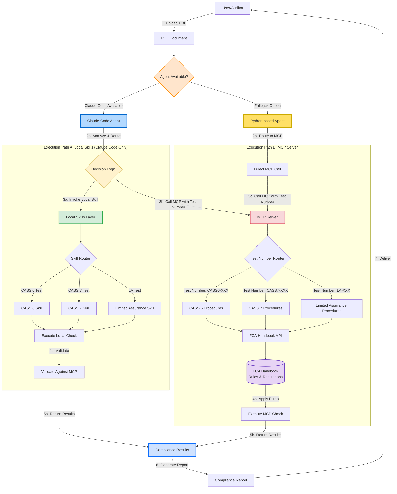

# FCA Compliance Checking System Architecture

This document describes the architecture for the FCA CASS 6, CASS 7, and Limited Assurance compliance checking system.

## System Overview

The system provides two parallel execution paths with flexibility to use either Claude Code Agent (when available) or a Python-based agent as a fallback.

## Architecture Diagram

## Data Flow

### Step 1: PDF Upload
User/Auditor uploads a compliance document (PDF format) for checking.

### Step 2: Agent Selection
System determines which agent to use:
- **Claude Code Agent** (preferred): If organizational access is available
- **Python-based Agent** (fallback): If Claude Code is unavailable

### Step 3: Execution Paths

#### Path A: Local Skills (Claude Code Only)
- Fast, locally-executed compliance checks
- Uses Claude Code skills for CASS 6, CASS 7, and Limited Assurance
- Validates results against MCP server for accuracy

#### Path B: MCP Server (Both Agents)
- Direct calls to central MCP server with test numbers
- Test number format: `CASS6-XXX`, `CASS7-XXX`, `LA-XXX`
- Connects to FCA Handbook for authoritative rules and regulations
- Executes compliance procedures with up-to-date regulatory requirements

### Step 4: Results
Both execution paths return compliance results to the system.

### Step 5: Report Generation
System generates a comprehensive compliance report.

### Step 6: Delivery
Final report delivered to user/auditor.

## Components

### Agent Layer
- **Claude Code Agent** (Blue): Advanced AI agent with local skills and MCP integration
- **Python-based Agent** (Yellow): Lightweight fallback using Python MCP client libraries

### Local Skills (Green)
- CASS 6 Skill - Client money procedures
- CASS 7 Skill - Client asset procedures
- Limited Assurance Skill - Review procedures

### MCP Server (Red)
- Central server providing authoritative compliance procedures
- Test number routing for specific checks
- FCA Handbook API integration

### FCA Handbook (Purple)
- Source of truth for FCA rules and regulations
- Live updates to regulatory requirements
- Supports CASS 6, CASS 7, and Limited Assurance procedures

## Test Number Convention

Tests are identified by standardized numbers:
- **CASS 6**: `CASS6-001`, `CASS6-002`, etc.
- **CASS 7**: `CASS7-001`, `CASS7-002`, etc.
- **Limited Assurance**: `LA-001`, `LA-002`, etc.

## Implementation Strategy

### With Claude Code Access
1. Develop local skills for fast execution
2. Use MCP server for validation and complex checks
3. Leverage both execution paths for optimal performance

### Without Claude Code Access (Fallback)
1. Implement Python-based agent using MCP client library
2. Route all checks through MCP server
3. Ensure consistent results via FCA Handbook integration

## Benefits

- **Flexibility**: Works with or without Claude Code organizational access
- **Reliability**: MCP server provides authoritative source of truth
- **Performance**: Local skills offer fast execution when available
- **Accuracy**: All results validated against FCA Handbook regulations
- **Maintainability**: Centralized rule updates through MCP server
